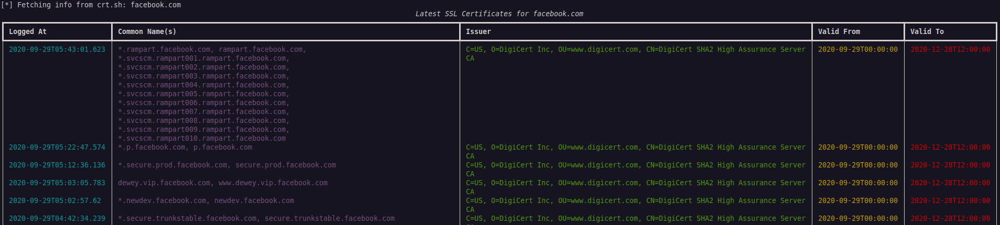

# 🕵️‍♂️ ShadowRecon

**ShadowRecon** is a powerful, minimalist passive reconnaissance tool written in Python. It helps gather domain intelligence using public sources like `crt.sh`, making it ideal for OSINT, bug bounty, or red teaming.

---

## 🚀 Features

- 🔍 Fetch SSL certificate data from **crt.sh**
- 🌐 Retrieve domain WHOIS information (Coming soon)

---

## 📦 Installation

1. **Clone the repo**
```bash
git clone https://github.com/yourusername/shadowrecon.git
```
2. **Go to the directory**
```bash
cd shadowrecon
```
3. **Install Dependencies**
```bash
pip install -r requirements.txt
```

## 🧪 Usage
```bash
python main.py <domain> [OPTIONS]
```
## 🔹 Example:
```bash
python main.py example.com --crt
```
### 🛠 Options

| Option     | Description                            |
|------------|----------------------------------------|
| `--crt`    | Get latest certificate data via crt.sh |
| `--whois`  | Get WHOIS info for the domain *(WIP)*  |

## 📸 Screenshot



